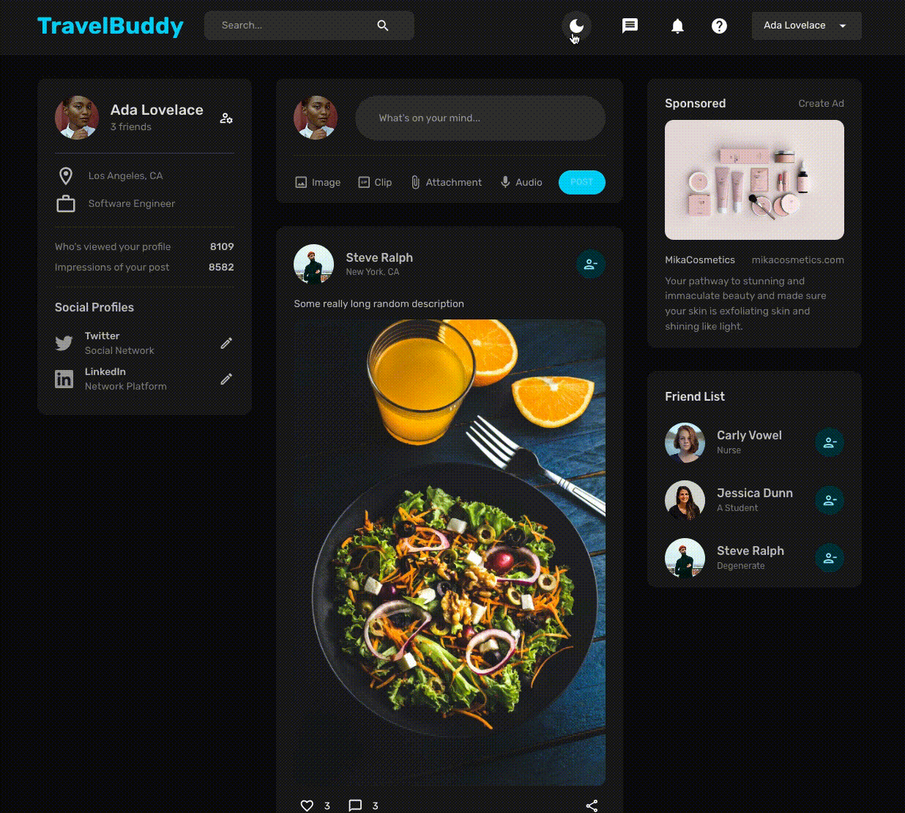

<!-- Improved compatibility of back to top link: See: https://github.com/othneildrew/Best-README-Template/pull/73 -->

<a name="readme-top"></a>

<!--
*** Thanks for checking out the Best-README-Template. If you have a suggestion
*** that would make this better, please fork the repo and create a pull request
*** or simply open an issue with the tag "enhancement".
*** Don't forget to give the project a star!
*** Thanks again! Now go create something AMAZING! :D
-->

<!-- PROJECT SHIELDS -->
<!--
*** I'm using markdown "reference style" links for readability.
*** Reference links are enclosed in brackets [ ] instead of parentheses ( ).
*** See the bottom of this document for the declaration of the reference variables
*** for contributors-url, forks-url, etc. This is an optional, concise syntax you may use.
*** https://www.markdownguide.org/basic-syntax/#reference-style-links
-->

[![Contributors][contributors-shield]][contributors-url]
[![Forks][forks-shield]][forks-url]
[![Stargazers][stars-shield]][stars-url]
[![Issues][issues-shield]][issues-url]
[![MIT License][license-shield]][license-url]
[![LinkedIn][linkedin-shield]][linkedin-url]

<!-- PROJECT LOGO -->
<br />
<div align="center">
  <a href="https://github.com/HelenGezahegn/social-media-app">
    
  </a>

<h3 align="center">TravelBuddy</h3>

  <p align="center">
    Connect with fellow travellers!
    <br />
    <a href="https://github.com/HelenGezahegn/social-media-app"><strong>Explore the docs »</strong></a>
    <br />
    <br />
    <a href="https://travel-buddy-1.vercel.app">View Demo</a>
    ·
    <a href="https://github.com/HelenGezahegn/social-media-app/issues">Report Bug</a>
    ·
    <a href="https://github.com/HelenGezahegn/social-media-app/issues">Request Feature</a>
  </p>
</div>

<!-- TABLE OF CONTENTS -->
<details>
  <summary>Table of Contents</summary>
  <ol>
    <li>
      <a href="#about-the-project">About The Project</a>
      <ul>
        <li><a href="#built-with">Built With</a></li>
      </ul>
    </li>
    <li>
      <a href="#getting-started">Getting Started</a>
      <ul>
        <li><a href="#prerequisites">Prerequisites</a></li>
        <li><a href="#installation">Installation</a></li>
      </ul>
    </li>
    <li><a href="#usage">Usage</a></li>
    <li><a href="#roadmap">Roadmap</a></li>
    <li><a href="#contributing">Contributing</a></li>
    <li><a href="#license">License</a></li>
    <li><a href="#contact">Contact</a></li>
  </ol>
</details>

<!-- ABOUT THE PROJECT -->

## About The Project

<div align="center">

</div>
<!-- [![Product Name Screen Shot][product-screenshot]](https://example.com) -->
<br />

TravelBuddy is the ultimate social media app designed exclusively for wanderlust-driven globetrotters, adventure seekers, and travel enthusiasts. Whether you're a solo backpacker, a family explorer, or an avid jet-setter, TravelBuddy is your digital passport to a world of incredible experiences and connections. On the app, you can: 
* Easily find and connect with travelers who share your interests, itineraries, or travel styles.
* Forge new friendships, plan meetups, and embark on epic adventures together.
* Discover the most breathtaking destinations, hidden gems, and must-visit spots by engaging in our vast community of fellow travelers around the globe.


<p align="right">(<a href="#readme-top">back to top</a>)</p>

### Built With

- [![React][React.js]][React-url]
- [![React Router][React-Router-dev]][React-Router-url]
- [![Redux][Redux-dev]][Redux-url]
- [![Node.js][Node-dev]][Node-url]
- [![Express][Express-dev]][Express-url]
- [![MongoDB][Mongo-dev]][Mongo-url]
- [![Material UI][Material-dev]][Material-url]
- [![Vercel][Vercel-dev]][Vercel-url]

<p align="right">(<a href="#readme-top">back to top</a>)</p>

<!-- GETTING STARTED -->

## Getting Started

Built from scratch, this project contains a backend and a frontend denoted by the "server" and "client" folders respectively. To get a local copy up and running, follow these steps.

### Backend

1. Setup MongoDB
- [Sign up for a MongoDB account](mongodb.com)
- [Create a cluster](https://www.mongodb.com/docs/guides/atlas/cluster/).
  - When prompted, create a `.env` file in the `server` directory and add the API key provided called `MONGO_URL`.
- [Add a database user](https://www.mongodb.com/docs/guides/atlas/db-user/)
- [Configure a network connection](https://www.mongodb.com/docs/guides/atlas/network-connections/)

2. Clone the repo
   ```sh
   git clone https://github.com/HelenGezahegn/social-media-app.git
   ```
3. Install NPM packages
   ```sh
   npm install
   ```
4. Create a `.env` file in the `server` directory. Add your port, MongoDB API, and JWT keys.
   ```js
   PORT = 3001;
   MONGO_URL = XYZ;
   JWT_SECRET = XYZ;
   ```
5. Run it!
   ```js
   npm run start
   ```

### Frontend

In another terminal:

1. Install NPM packages

   ```sh
   npm install
   ```

2. Run it! Open [http://localhost:3000](http://localhost:3000) to view it in your browser. This page will reload when you make changes and display lint errors in the console.

   ```sh
   npm run start
   ```

<p align="right">(<a href="#readme-top">back to top</a>)</p>

<!-- USAGE EXAMPLES -->

## Usage

Demo video coming soon.

<p align="right">(<a href="#readme-top">back to top</a>)</p>

<!-- ROADMAP -->

## Roadmap

- [ ] Add cloud file storage for assets
- [ ] Add more to posts than an image or test
  - [ ] gif or video
  - [ ] attachments like a PDF
  - [ ] audio
- [ ] Add chat
- [ ] Add notifications
- [ ] Add help information (e.g. report a bug)
- [ ] Link other social profiles and make it editable
- [ ] Make user settings dynamic
- [ ] Fix profile views and impressions to be real numbers
- [ ] Scrap the web for advertisements instead of fixed ad

See the [open issues](https://github.com/HelenGezahegn/social-media-app/issues) for a full list of proposed features (and known issues).

<p align="right">(<a href="#readme-top">back to top</a>)</p>

<!-- CONTRIBUTING -->

## Contributing

Contributions are what make the open source community such an amazing place to learn, inspire, and create. Any contributions you make are **greatly appreciated**.

If you have a suggestion that would make this better, please fork the repo and create a pull request. You can also simply open an issue with the tag "enhancement".
Don't forget to give the project a star! Thanks again!

1. Fork the Project
2. Create your Feature Branch (`git checkout -b feature/AmazingFeature`)
3. Commit your Changes (`git commit -m 'Add some AmazingFeature'`)
4. Push to the Branch (`git push origin feature/AmazingFeature`)
5. Open a Pull Request

<p align="right">(<a href="#readme-top">back to top</a>)</p>

<!-- LICENSE -->

## License

Distributed under the MIT License. See `LICENSE.txt` for more information.

<p align="right">(<a href="#readme-top">back to top</a>)</p>

<!-- CONTACT -->

## Contact

Helen Gezahegn

[![LinkedIn][linkedin-shield]][linkedin-url]

gezahegn@ualberta.ca

Project Link: [https://sociopedia-app-1.vercel.app](https://sociopedia-app-1.vercel.app)

<p align="right">(<a href="#readme-top">back to top</a>)</p>

<!-- MARKDOWN LINKS & IMAGES -->
<!-- https://www.markdownguide.org/basic-syntax/#reference-style-links -->

[contributors-shield]: https://img.shields.io/github/contributors/HelenGezahegn/social-media-app.svg?style=for-the-badge
[contributors-url]: https://github.com/HelenGezahegn/social-media-app/graphs/contributors
[forks-shield]: https://img.shields.io/github/forks/HelenGezahegn/social-media-app.svg?style=for-the-badge
[forks-url]: https://github.com/HelenGezahegn/social-media-app/network/members
[stars-shield]: https://img.shields.io/github/stars/HelenGezahegn/social-media-app.svg?style=for-the-badge
[stars-url]: https://github.com/HelenGezahegn/social-media-app/stargazers
[issues-shield]: https://img.shields.io/github/issues/HelenGezahegn/social-media-app.svg?style=for-the-badge
[issues-url]: https://github.com/HelenGezahegn/social-media-app/issues
[license-shield]: https://img.shields.io/github/license/HelenGezahegn/social-media-app.svg?style=for-the-badge
[license-url]: https://github.com/HelenGezahegn/social-media-app/blob/master/LICENSE.txt
[linkedin-shield]: https://img.shields.io/badge/-LinkedIn-black.svg?style=for-the-badge&logo=linkedin&colorB=555
[linkedin-url]: https://linkedin.com/in/HelenGezahegn
[product-screenshot]: images/screenshot.png
[Mongo-dev]: https://img.shields.io/badge/MongoDB-4EA94B?style=for-the-badge&logo=mongodb&logoColor=white
[Mongo-url]: https://mongodb.com
[React.js]: https://img.shields.io/badge/React-20232A?style=for-the-badge&logo=react&logoColor=61DAFB
[React-url]: https://reactjs.org/
[Express-dev]: https://img.shields.io/badge/Express.js-404D59?style=for-the-badge
[Express-url]: https://expressjs.com/
[Redux-dev]: https://img.shields.io/badge/Redux-593D88?style=for-the-badge&logo=redux&logoColor=white
[Redux-url]: https://react-redux.js.org/
[React-Router-dev]: https://img.shields.io/badge/React_Router-CA4245?style=for-the-badge&logo=react-router&logoColor=white
[React-Router-url]: https://reactrouter.com/
[Material-dev]: https://img.shields.io/badge/Material--UI-0081CB?style=for-the-badge&logo=material-ui&logoColor=white
[Material-url]: https://mui.com/material-ui/
[Node-dev]: https://img.shields.io/badge/Node.js-43853D?style=for-the-badge&logo=node.js&logoColor=white

[Node-url]: [https://getbootstrap.com](https://nodejs.org/en)
[Vercel-dev]: https://img.shields.io/badge/Vercel-000000?style=for-the-badge&logo=vercel&logoColor=white
[Vercel-url]: https://vercel.com
